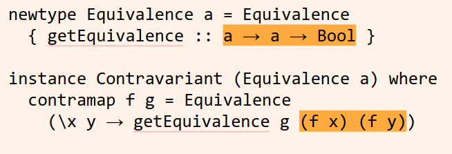

Day 3: Profunctors

(we started the day off by going through contravariance thoroughly, slides from that are here: https://docs.google.com/presentation/d/1UA-90B_oTO8g_8Tr1mVmokM0PWAl1cqdsRAbjWrkofg/edit?usp=sharing)

# A code example

from Tom Harding's excellent series on functional programming http://www.tomharding.me/2017/03/13/fantas-eel-and-specification-4/

# Lots of JavaScript

```
const Customer = daggy.tagged('Customer', [
  'name',             // String
  'favouriteThings',  // [String]
  'registrationDate', // Int -- since epoch
  'hasMadePurchase'   // Bool
])

const myStrategy = {
  // to :: Customer
  //    -> Tuple4 (First String)
  //              [String]
  //              (Min Int)
  //              (Any Bool)
  to: customer => Tuple4(
    First(customer.name),

    // Arrays are semigroups already!
    // We could use Set, though.
    customer.favouriteThings,

    Min(customer.registrationDate),

    Any(customer.hasMadePurchase)
  ),

  // from :: Tuple4 (First String)
  //                [String]
  //                (Min Int)
  //                (Any Bool)
  //      -> Customer
  from: ({ a, b, c, d }) =>
    Customer(a.val, b, c.val, d.val)
}

// merge :: Semigroup m
//       => { to   :: a -> m
//          , from :: m -> a }
//       -> a -> a -> a
const merge = strategy => x => y =>
  strategy.from(
    strategy.to(x)
      .concat(strategy.to(y))
  )
```

# Let's write profunctors!

The process is like this:

We take two customer records with four fields and convert them to four-tuples.

(that's the `f` in our `dimap f g h`)

# Let's write profunctors!

Then we use a `Semigroup` (like a `Monoid` but with no identity value) instance to *merge* each field of the two tuples.

(that's the `h` in our `dimap f g h`)

# Let's write profunctors!

Then we convert the merged tuple back into a record with four fields.

(that's the `g` in our `dimap f g h`)

# Let's write profunctors!

It's a little weird because we take in *two* things but only return *one*.

# Let's write profunctors!

If you want to follow along:

- add imports

```haskell
import Data.Semigroup
import Data.Profunctor
```

- open a `stack repl` that has the `profunctors` package loaded

```haskell
$ stack repl --package profunctor
```

# Let's write profunctors!

We need a `Customer` type and `to` and `from` functions to replicate Tom's example.

Let's simplify this a little, because we haven't covered `Semigroup` much. So we'll use a simple `Semigroup`.

```haskell
data Customer = Customer {
                knownAliases :: [String],
                genders :: [String]
                }
                deriving (Eq, Show)
```

#

```haskell
to :: Customer -> ([String], [String])
to (Customer xs ys) = (xs, ys)

from :: ([String], [String]) -> Customer
from (xs, ys) = Customer xs ys
```

# Let's write profunctors!

Now we will make a `Combiner` type that, given two tuples, will merge them.

```haskell
newtype Combiner a b = Combiner (a -> a -> b)
```

# Let's write profunctors!

Next we will write a `Profunctor` instance for our `Combiner` type.

```haskell
instance Profunctor Combiner where
  dimap f g (Combiner c) =
  -- f ~ `to`; g ~ `from`
```

# Let's write profunctors!



# Let's write profunctors!

```haskell
instance Profunctor Combiner where
  dimap f g (Combiner c) =
    Combiner (\x y -> g (c (f x) (f y))
-- f ~ `to` ; g ~ `from` ; c ~ Combiner function
```

# Let's write profunctors!

We've kept our types simple to avoid having to choose semigroups.
Using `(<>)` with lists (and lists of `String`) will just give us concatenation.

Notice our `Combiner` arguments are the same.

```haskell
semigroupCombiner :: Semigroup a => Combiner a a
semigroupCombiner = Combiner (<>)
```

# Let's write profunctors!

```haskell
customerCombiner :: Combiner Customer Customer
customerCombiner = dimap to from semigroupCombiner
```

# Let's write profunctors!

```haskell
mergeCustomers :: Customer -> Customer -> Customer
mergeCustomers x y =
    case customerCombiner of
        Combiner c -> c x y
```
